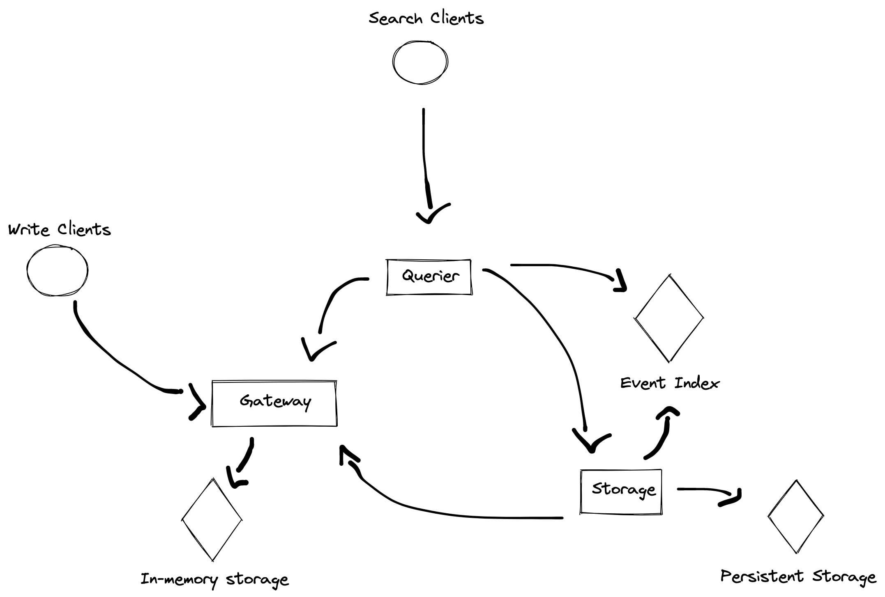

## Event Sync
Small microsservice ecosystem to ingest, persist and query events. This project was created to put in practice a couple technologies I've been interested in studying:
- GRPC
- Typescript performance optmization

## Architecture

This system is composed of three microsservices:

- **Gateway**: Responsible for ingesting events. Events should be temporarily stored in a low latency backend. Ingestion is handled by HTTP endpoints while the temporary storage should be abstracted and queried by GRPC endpoints.
- **Storage**: Responsible for long term storage and indexing of events, events are periodically fetched from **Gateway** and persisted in a long term storage solution. **Storage** should also provide access to it's backend via GRPC endpoints.
- **Querier**: Responsible for exposing HTTP endpoints that allow clients to query events, **Querier** accesses both **Gateway's** and **Storage's** GRPC endpoints to fulfill requests.

